<p align="center">
  
</p>

<p align="center">
  A Claude Code plugin for research, investigation, and deep exploration of topics.
</p>

---

## Skills

### researcher

Structured research with three depth levels. Searches the web, academic papers, and citation graphs. Adapts to whatever tools are available in your environment.

| Depth | What it does |
|-------|-------------|
| **quick** | 1 round, sequential. Single facts, quick lookups. |
| **deep** | 2-3 rounds, parallel subagents. Multi-faceted topics, comparisons. |
| **exhaustive** | 3+ rounds until saturation. Literature surveys, comprehensive analysis. |

**Sources it can tap:**
- Web search (WebSearch)
- Page content (WebFetch)
- arXiv API (for STEM papers)
- Semantic Scholar API (citations, impact, recommendations)
- context7 MCP (library docs)
- Local PDFs (Read tool)

## Install

**From source (development):**
```bash
claude --plugin-dir /path/to/curiosity-skills
```

Then invoke with:
```
/curiosity-skills:researcher
```

Or just ask Claude to research something -- the skill triggers on phrases like "research", "look into", "investigate", "what does the literature say".

**Examples:**
```
Research what MCP (Model Context Protocol) is -- quick
Research the current state of GRPO reinforcement learning -- deep
Do an exhaustive survey of chain-of-thought prompting techniques
```

## Output

Results are presented conversationally by default. For substantial research (10+ sources), the skill saves a report to `research/YYYY-MM-DD-<topic>.md`.

Output includes:
- Summary
- Key findings grouped by theme
- Contradictions and open questions
- Numbered sources with URLs

Academic research adds: paper count, key papers table, citation graph highlights.

## Structure

```
curiosity-skills/
  .claude-plugin/
    plugin.json                         # Plugin manifest
  skills/
    researcher/
      SKILL.md                          # Core skill
      references/
        arxiv-api.md                    # arXiv search, BibTeX, parsing
        semantic-scholar-api.md         # Citations, impact, recommendations
```

## License

MIT
